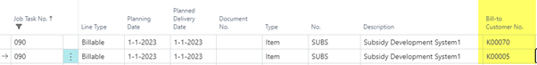

# Manual Multi Customer Jobs
For some research and development (R&D) projects you might get a subsidy from one or more organizations.
To receive this subsidy, you probably want to send a sales invoice to the grant provider. 

In the Business Central standard application, this is not possible within one project.
The Multi Customer Jobs solution of Bluace make it possible to create job planning lines for different customers within one project.

## Job Planning Lines
In the job planning line we now have a new field: Bill-to Customer Number
This gives you the possibility to make multiple job planning lines with different Bill-To Customers.

[:arrow_left:](../README.md) [Back](../README.md)