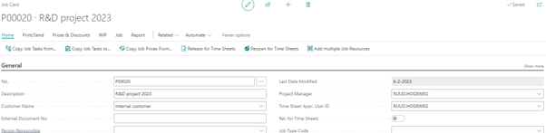

# Manual Multi Customer Jobs

For some research and development (R&D) projects you might get a subsidy from one or more organizations.
To receive this subsidy, you probably want to send a sales invoice to the grant provider. 

In the Business Central standard application, this is not possible within one project.
The Multi Customer Jobs solution of Bluace make it possible to create job planning lines for different customers within one project.

## Job
Create a job (project) like you are used to. The customer of the job can be the customer that will receive the sales invoice by default.

[:arrow_left:](../README.md) [Back](../README.md)